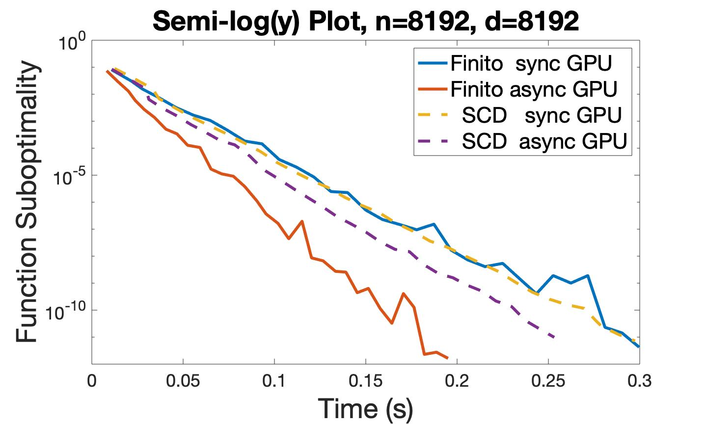
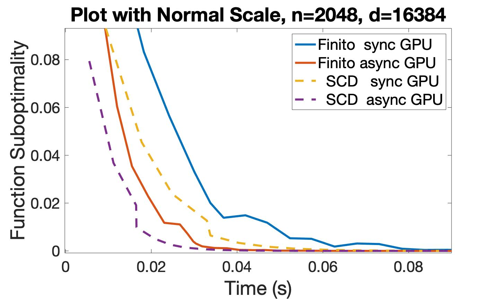

# Asynchronous Optimization Algorithms with GPU
**Please refer to the [poster](poster.pdf) and my [presentation](presentation.pdf) for more details.**

As the number of computational cores in CPUs and GPUs increases, so
does the cost of synchronization in parallel computing, and the need
for asynchronous algorithms grows. This project studies asynchronous
optimizations algorithms on GPUs.

GPUs have many more cores than CPUs do. However, the cores have small
local memory and are limited in their capability to communicate and
coordinate. Therefore, reducing the use of local memory and the amount
of communication and coordination is essential for designing an
asynchronous algorithm efficient on GPUs.

We extended the optimization algorithms [stochastic coordinate
descent](https://arxiv.org/abs/1311.1873) and
[Finito](https://arxiv.org/abs/1407.2710) to the asynchronous setup
and implemented them on CPUs and GPUs. We observed that the
asynchronous GPU algorithms were 20--30x faster than the asynchronous
CPU algorithms, which were 3.6--4x faster than the synchronous
parallel CPU algorithms.

# Codes
All optimization algorithms are written C++/CUDA C and encapsulated as
a MEX file to be called by MATLAB. The function to be optimized is a
binary logistic cost function.

Folder [_SCD_](SCD/) contains four setups of optimization algorithms
Stochastic Coordinate Descent. [_sync\_parallel_](SCD/sync_parallel)
and [_async\_parallel_](SCD/async_parallel) respectively contain
synchronous parallel and asynchronous parallel setup written in C++ to
be run on multi-core CPU. [_sync\_cuda_](SCD/sync_cuda) and
[_async\_cuda_](SCD/async_cuda) respectively contain synchronous and
asynchronous setup written in CUDA C to be run on GPU.

Folder [_Finito_](Finito/) contains the same four setups as in _SCD_
in folder [_sync\_parallel_](Finito/sync_parallel),
[_async\_parallel_](Finito/async_parallel),
[_sync\_cuda_](Finito/sync_cuda), and
[_async\_cuda_](Finito/async_cuda). In addition, it is also exploring
different ways to implement asynchronous CUDA setup of Finito on
multi-GPU machines.

Folder [_development_](development/) contains simple and abstract
codes I wrote when I developed more complex codes.

# Performance
**Please refer to the [poster](poster.pdf) and my [presentation](presentation.pdf) for more details.**

Plot with Normal Scale     |  Semi-log(y) Plot
:-------------------------:|:-------------------------:
|
|
|

# Requirement
- CUDA GPU compute capability 7.x 
- CUDA 10.1
- C++ compiler that supports C++ 17 standards
- MATLAB 2019a

# Reference
- Defazio, Aaron, and Justin Domke. ["Finito: A faster, permutable
incremental gradient method for big data
problems."](https://arxiv.org/abs/1407.2710) In International
Conference on Machine Learning, pp. 1125-1133. 2014.

- Liu, Ji, Stephen J. Wright, Christopher Ré, Victor Bittorf, and
Srikrishna Sridhar. ["An asynchronous parallel stochastic coordinate
descent algorithm."](https://arxiv.org/abs/1311.1873) The Journal of
Machine Learning Research 16, No. 1 (2015): 285-322.

